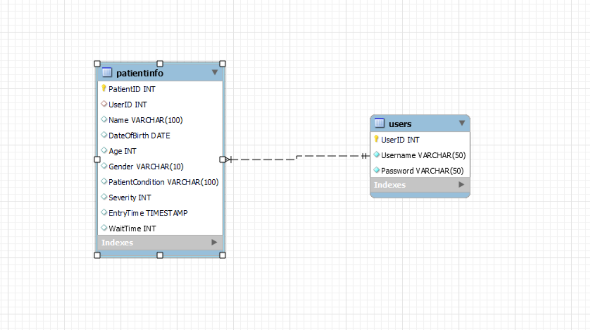

# Hospital Triage Database Design Documentation

## Overview:
This document describes the design of the Hospital Triage database used in the Hospital Triage App. The database is structured to manage patient data, including their personal information and triage details such as severity of condition and waiting times.

## Database Schema
### Tables
1.**Users**:
- Description: Stores information about users who can log into the system. Primarily, it includes hospital staff and administrators.
- Attributes:
-- UserID (INT, AUTO_INCREMENT, PRIMARY KEY): Unique identifier for each user.
-- Username (VARCHAR(50)): The username for the user's account.
-- Password (VARCHAR(50)): The encrypted password for the user's account.

2.**PatientInfo**:
- Description: Contains detailed information about patients, their medical conditions, and triage data.
- Attributes:
-- PatientID (INT, AUTO_INCREMENT, PRIMARY KEY): Unique identifier for each patient.
-- UserID (INT, FOREIGN KEY REFERENCES Users(UserID)): The user ID of the staff who recorded the patient's data.
-- Name (VARCHAR(100)): The name of the patient.
-- DateOfBirth (DATE): Patient's date of birth.
-- Age (INT): Patient's age.
-- Gender (VARCHAR(10)): Patient's gender.
-- PatientCondition (VARCHAR(100)): Description of the -- patient's medical condition.
-- Severity (INT): Severity level of the patient's condition.
-- EntryTime (TIMESTAMP, DEFAULT CURRENT_TIMESTAMP): The time when the patient was entered into the system.
-- WaitTime (INT): Calculated wait time based on the severity of the condition.

## Relationships
The PatientInfo table references the Users table through the UserID field, linking patient records to the users who entered them.

## Database Operation
### User Authentication:
- Users (hospital staff) can log in to the system using their credentials stored in the Users table.
- This process involves querying the Users table to validate the provided username and password.
## Attributes Specification

### Patient Registration:
- When a new patient arrives, their details are entered into the PatientInfo table.
- The user handling the registration (identified by their UserID) is also recorded with the patient's data.

### Triage and Wait Time Calculation:
- The Severity field in the PatientInfo table is used to determine the urgency of the patient's condition.
- Based on the severity, an initial WaitTime is assigned (handled by the application logic).

### Viewing and Updating Patient Records:
- The application can query the PatientInfo table to retrieve and display the list of patients, ordered by severity and entry time.
- Periodically, the WaitTime for each patient is decremented, simulating the passage of time in the waiting queue.

## Database ERD (Entity-Relationship Diagram)

## Conclusion
This database design supports the core functionalities of the Hospital Triage App, ensuring efficient management of patient data and triage processes. The structure is designed for scalability and ease of use, with a focus on the practical needs of a hospital triage system.